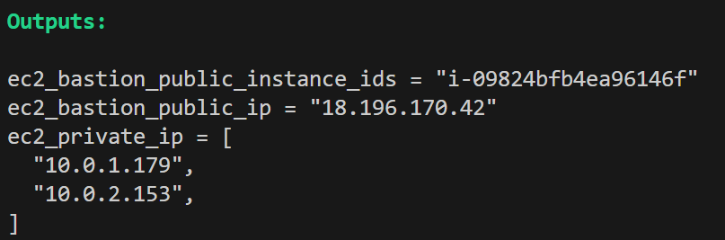
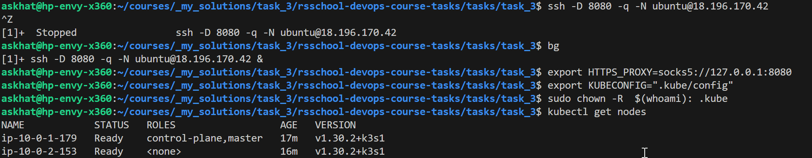
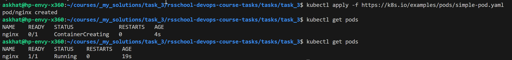

# Task 3

## 1. **Terraform Code for AWS Resources (10 points)**

    - Terraform code is created or extended to manage AWS resources required for the cluster creation.
    - The code includes the creation of a bastion host.
    

## 2. **Cluster Deployment (60 points)**

    - A K8s cluster is deployed using either kOps or k3s.
    - The deployment method is chosen based on the user's preference and understanding of the trade-offs.

## 3. **Cluster Verification (10 points)**

    - The cluster is verified by running the kubectl get nodes command from the local computer.
    - A screenshot of the kubectl get nodes command output is provided.
    

## 4. **Workload Deployment (10 points)**

    - A simple workload is deployed on the cluster using kubectl apply -f https://k8s.io/examples/pods/simple-pod.yaml.
    - The workload runs successfully on the cluster.
    

## 5. Additional Tasks (10 points)

    - Document the cluster setup and deployment process in a README file.
