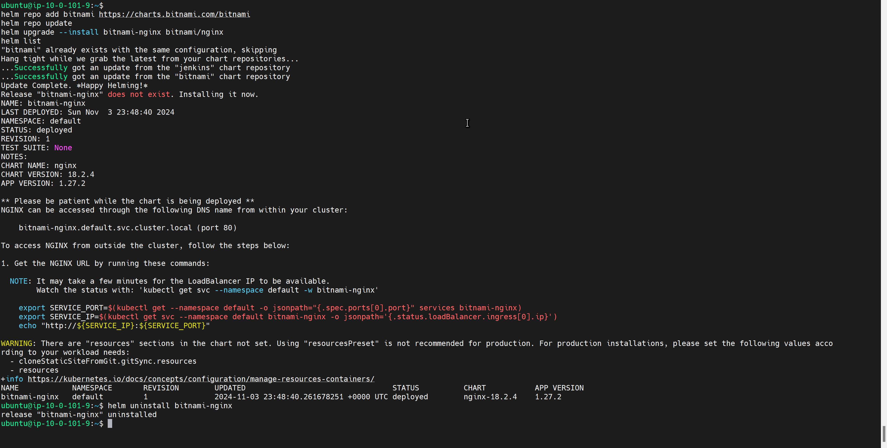
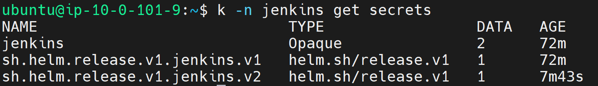

# Task 4

## 1. **Helm Installation and Verification (10 points)**

    - Helm is installed and verified by deploying the Nginx chart.

## 2. **Cluster Requirements (10 points)**

    - The cluster has a solution for managing persistent volumes (PV) and persistent volume claims (PVC).

## 3. **Jenkins Installation (50 points)**

    - Jenkins is installed using Helm in a separate namespace.
    - Jenkins is available from the internet.

## 4. **Jenkins Configuration (10 points)**

    - Jenkins configuration is stored on a persistent volume and is not lost when Jenkins' pod is terminated.

## 5. **Verification (10 points)**

    - A simple Jenkins freestyle project is created and runs successfully, writing "Hello world" into the log.

## 6. **Additional Tasks (10 points)**

    - GitHub Actions (GHA) Pipeline (5 points)
        A GHA pipeline is set up to deploy Jenkins.

    - Authentication and Security (5 points)
        Authentication and security settings are configured for Jenkins.
