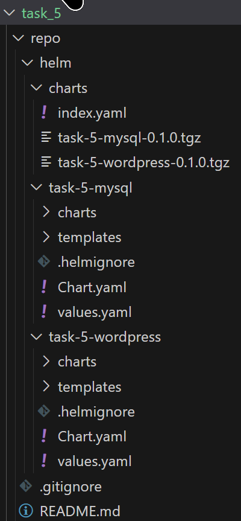
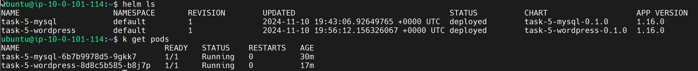
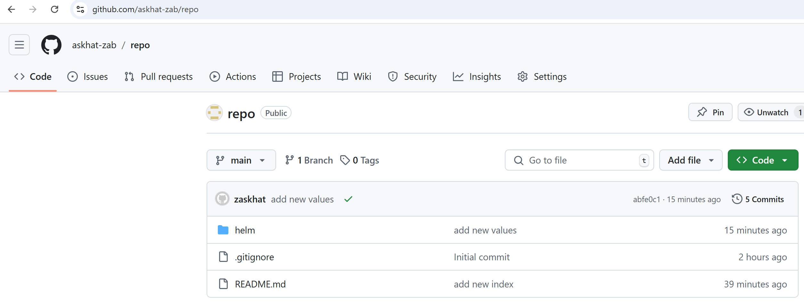
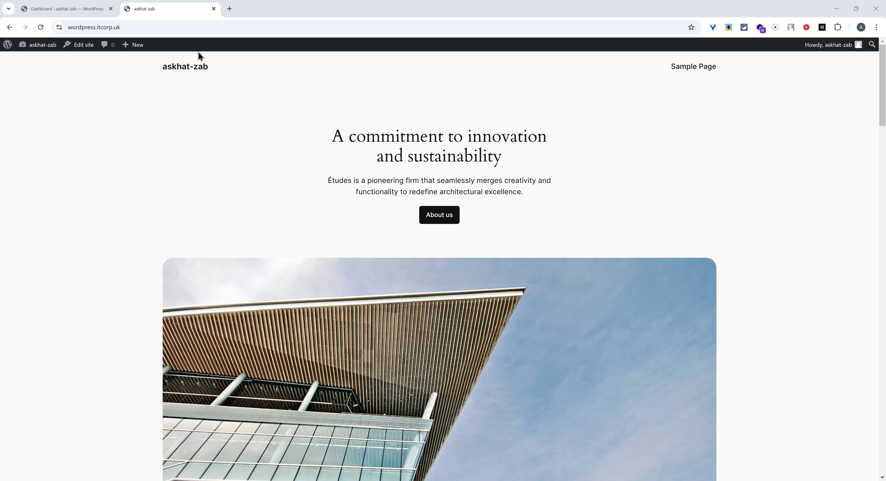
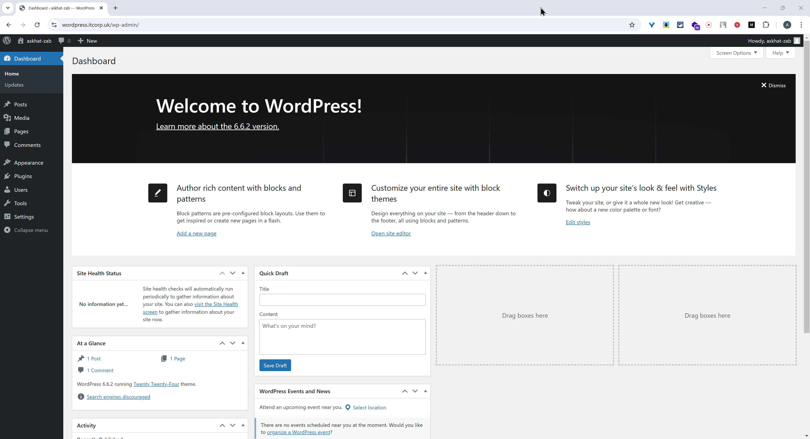

# Task 5

## 1. **Helm Chart Creation (40 points)**

    - A Helm chart for the WordPress application is created.

## 2. **Application Deployment (30 points)**

    - The application is deployed using the Helm chart.
    - The application is accessible from the internet.

## 3. **Repository Submission (5 points)**

    - A new repository is created with the WordPress and Helm chart.
[GitHub Repository](https://github.com/askhat-zab/repo)
[GitHub Pages](https://askhat-zab.github.io/repo/)

## 4. **Verification (5 points)**

    - The application is verified to be running and accessible.

## 5. **Additional Tasks (20 points)**

    - CI/CD Pipeline (10 points)
        - A CI/CD pipeline is set up to automate the deployment of the application.
[GHA](https://github.com/askhat-zab/rsschool-devops-course-tasks/actions/runs/11768587651/job/32778597693)

    - Documentation (10 points)
        - The application setup and deployment process are documented in a README file.
[README](https://github.com/askhat-zab/rsschool-devops-course-tasks/blob/task_5/README.md)

