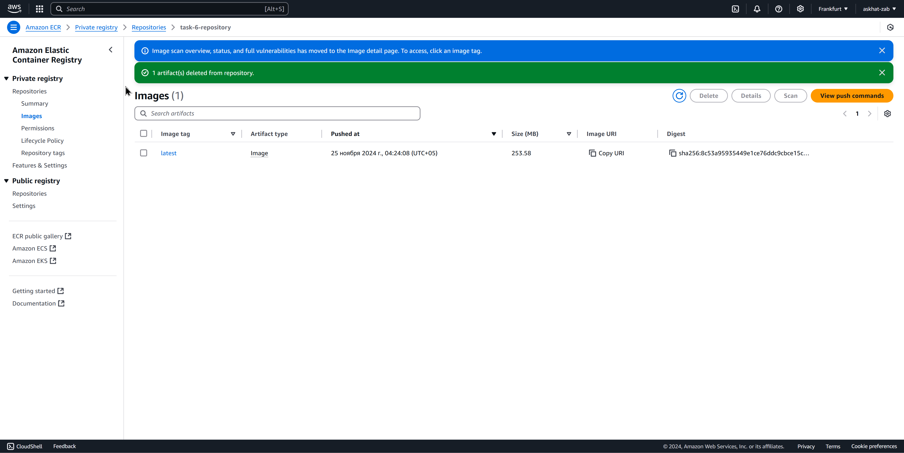
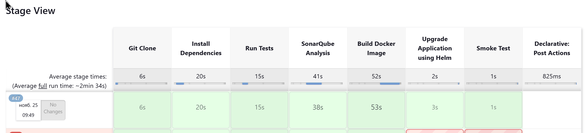
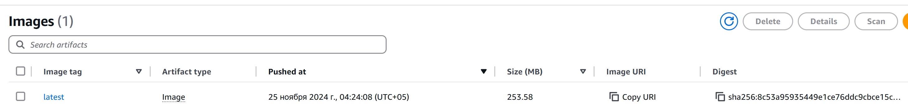
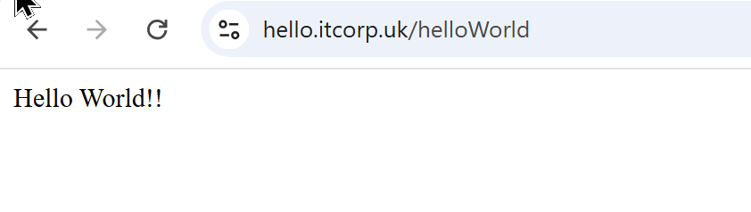
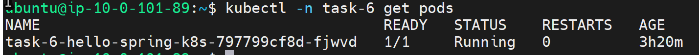
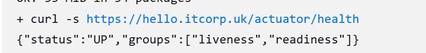

# Task 6

## 1. **Pipeline Configuration (40 points)**

    - A Jenkins pipeline is configured and stored as a Jenkinsfile in the main git repository.
    - The pipeline includes the following steps:
        - Application build
        - Unit test execution
        - Security check with SonarQube

        - Docker image building and pushing to ECR (manual trigger)
        - Deployment to K8s cluster with Helm (dependent on the previous step)

## 2. **Artifact Storage (20 points)**

    - Built artifacts (Dockerfile, Helm chart) are stored in git and ECR (Docker image).

## 3. **Repository Submission (5 points)**

    - A repository is created with the application, Helm chart, and Jenkinsfile.
[GitHub Repository](https://github.com/askhat-zab/repo)
[GitHub Pages](https://askhat-zab.github.io/repo/)

## 4. **Verification (5 points)**

    - The pipeline runs successfully and deploys the application to the K8s cluster.

## 5. **Additional Tasks (30 points)**

    - Application Verification (10 points)
        - Application verification is performed (e.g., curl main page, send requests to API, smoke test).

    - Notification System (10 points)
        - A notification system is set up to alert on pipeline failures or successes.
    - Documentation (10 points)
        - The pipeline setup and deployment process, are documented in a README file.
[README](https://github.com/askhat-zab/rsschool-devops-course-tasks/blob/task_6/README.md)
[README](https://github.com/askhat-zab/repo/blob/main/README.md)

