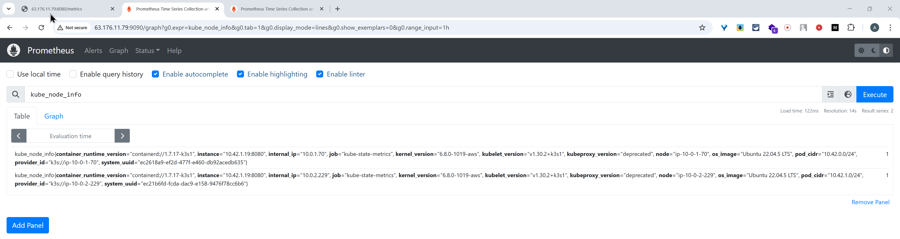

# Task 7

A README file is created or updated documenting the Prometheus deployment and configuration.

## 1. **Prometheus Installation (20 points)**
    - Prometheus is installed and running on the K8s cluster.

## 2. **Deployment Automation (30 points)**
    - Automation of deployment with IaC or CI/CD pipeline is created.
[Automation](https://github.com/askhat-zab/rsschool-devops-course-tasks/blob/task_7/.github/workflows/task_7.yaml)

## 3. **Web interface is available (10 points)**
    - Metrics can be checked via Prometheus web interface.

## 4. **Metrics Collection (35 points)**
    - Prometheus is collecting essential cluster-specific metrics, such as nodes' memory usage.

## 5. **Documentation is created (5 points)**
    - A README file is created or updated documenting the Prometheus deployment and configuration.
[README](https://github.com/askhat-zab/rsschool-devops-course-tasks/blob/task_7/README.md)

[course-README](https://github.com/askhat-zab/repo/blob/main/README.md)

