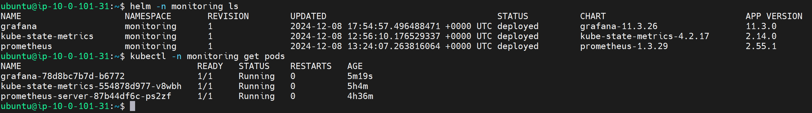
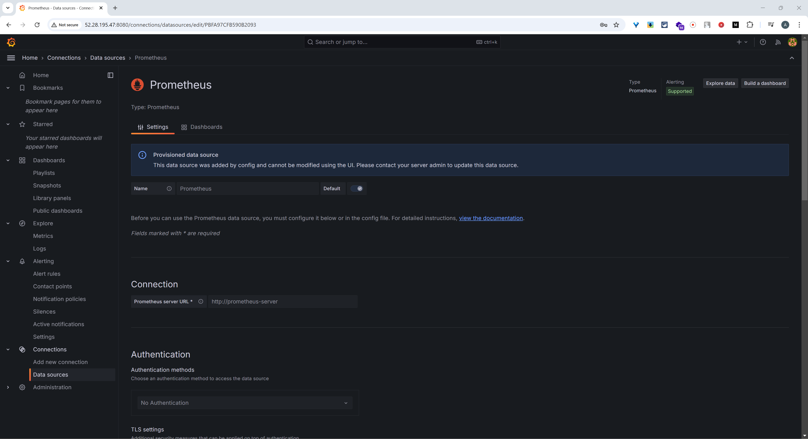
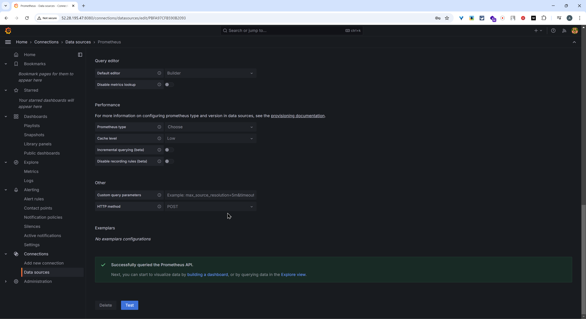
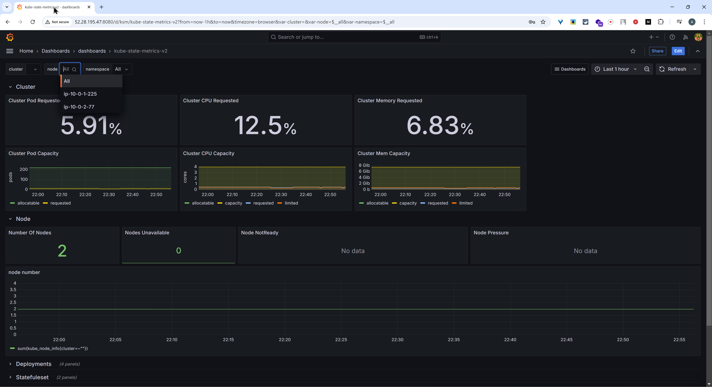
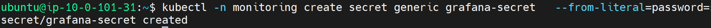

# Task 8
A README file is created or updated documenting the Grafana deployment and configuration.

## 1. **Grafana Installation (30 points)**
    - Grafana is installed on the K8s cluster using the Helm chart by Bitnami.

    - A data source pointing to the existing Prometheus installation is added.

## 2. **Dashboard Creation (40 points)**
    - A dashboard is created with basic metrics visualized, such as CPU and memory utilization, storage usage, etc.

## 3. **Deployment Automation (10 points)**
    - Automation of deployment with IaC or CI/CD pipeline is created.
[Automation](https://github.com/askhat-zab/rsschool-devops-course-tasks/blob/task_8/.github/workflows/task_8.yaml)

## 4. **Additional Tasks (20 points)**
    - Admin user password is created with a separate secret. (10 points)

    - A JSON file of the dashboard layout is provided. (5 points)
[Dashboard for KSM](https://grafana.com/grafana/dashboards/13332-kube-state-metrics-v2/)
    - The Grafana setup, including the dashboard creation, is documented in a README file. (5 points)
[README](https://github.com/askhat-zab/rsschool-devops-course-tasks/blob/task_8/README.md)

[course-README](https://github.com/askhat-zab/repo/blob/main/README.md)
