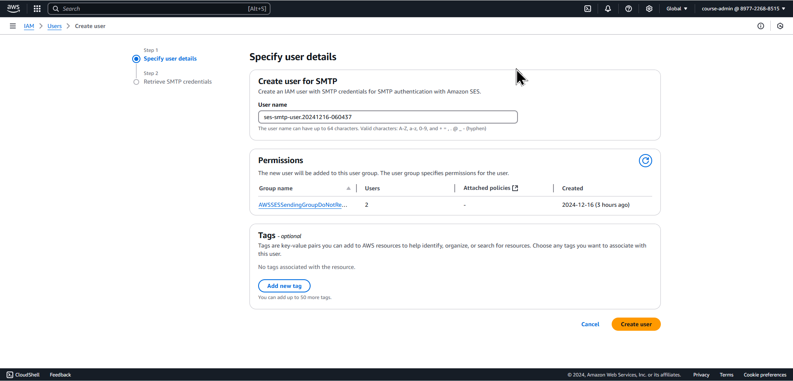
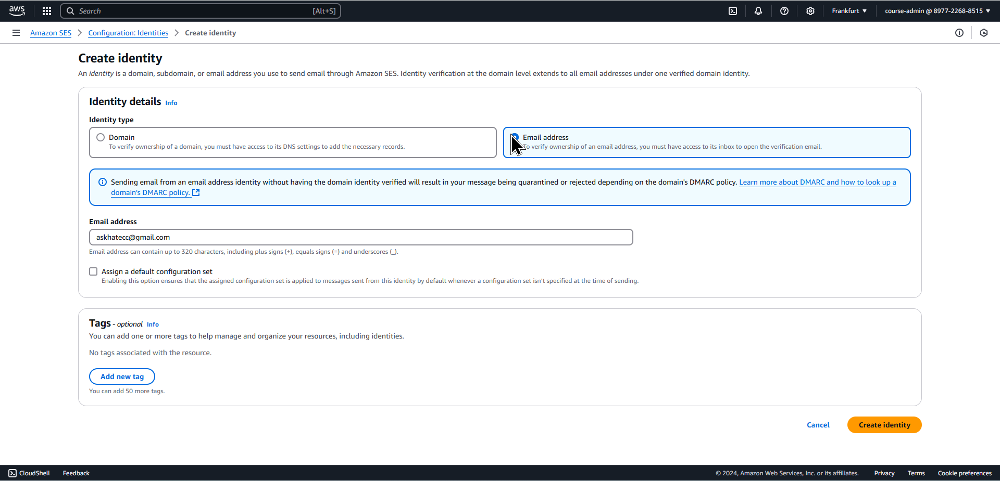
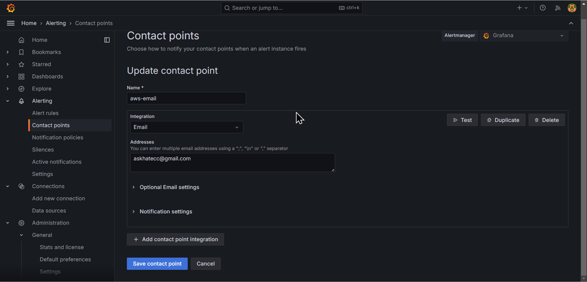
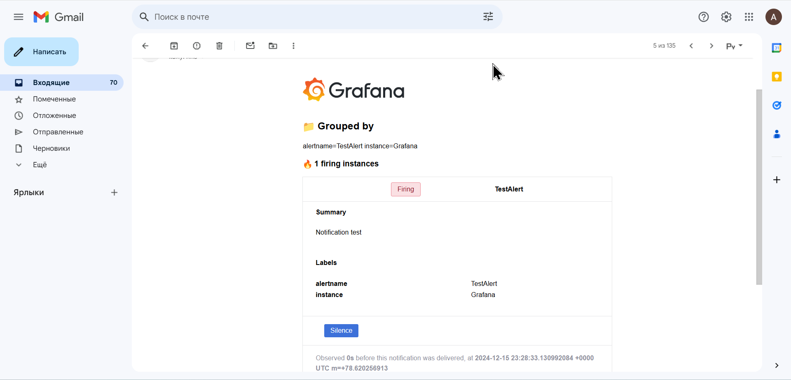
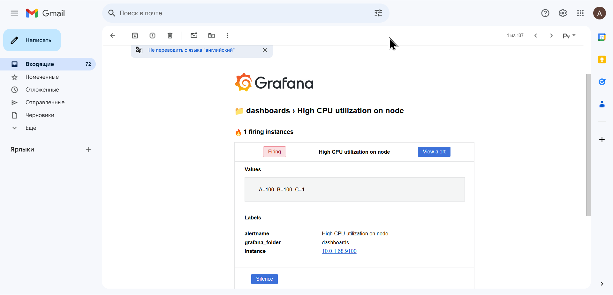
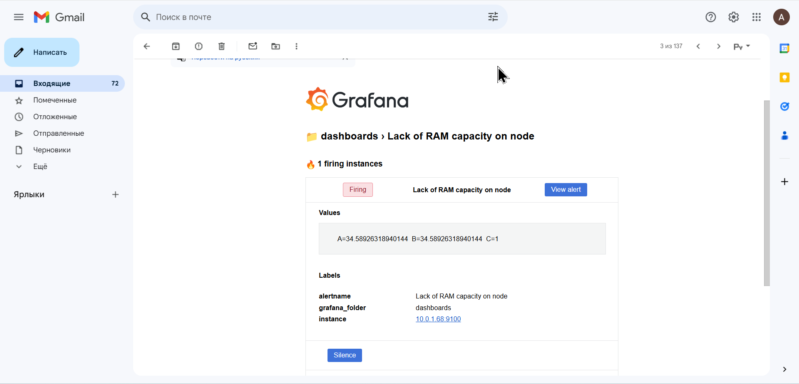
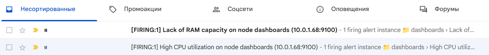
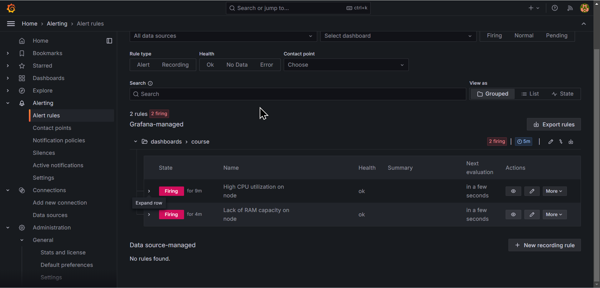
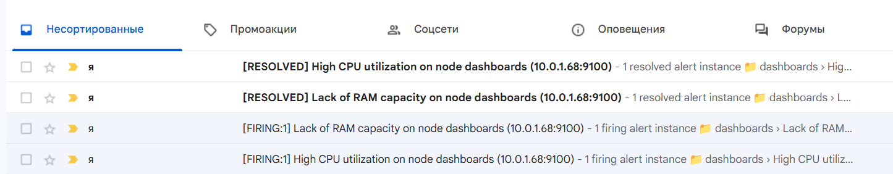

# Task 9
A README file is created or updated documenting the Grafana deployment and alert configuration.

## 1. **Contact Points created (10 points)**

## 2. **Alert Rules created (40 points)**
    - Alert Rules are configured to send alerts for the following events:
      - High CPU utilization on any node of the cluster.

      - Lack of RAM capacity on any node of the cluster.

    - Alerts are configured to be delivered to your email address.

## 3. **Alert Rules are working as expected (20 points)**
    - Alert Rules are firing when the specified events occur.

## 4. **Email is received (10 points)**

## 4. **Additional Tasks (20 points)**
    - Documentation (10 points)
      - The Alertmanager setup and alert configuration are documented in a README file.
[README](https://github.com/askhat-zab/rsschool-devops-course-tasks/blob/task_9/README.md)
[course-README](https://github.com/askhat-zab/repo/blob/main/README.md)
    - Configuration is done completely in code (10 points)
      - Alert Rules, Contact Points, and SMTP settings are configured using YAML files or other code-based methods.

